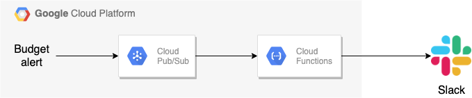
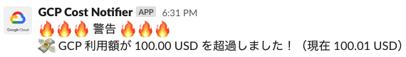

# gcp-cost-alert




Send alert to Slack when the cost exceeds the threshold set in Cloud Billing.

This system uses

- Cloud Billing
- Pub/Sub
- Google Cloud Functions
- Slack API

## Prerequisites

- [Set budgets and budget alerts](https://cloud.google.com/billing/docs/how-to/budgets)
    - in this example, alert thresholds are set as 20%, 50%, and 100% of the budget.
- [Create a Pub/Sub topic](https://cloud.google.com/pubsub/docs/quickstart-console) and register it to the budget alert.
- [Make Slack app and get Incoming Webhook URI](https://api.slack.com/messaging/webhooks)

## Enviroment Variables

Enviroment variables to use in GCF runtime are set in `env.yaml` file.

(sample)
```yaml
SLACK_WEBHOOK_URL: <slack webhook url>
```

## Test Commands

### Unit tests

Run unit tests in your local environment.

```
make test
```

### All tests (including Slack notification)

In addition to unit tests, you can run integration tests including Slack notification.

```
make test-all
```

### Local Run

Run the program locally and send a sample message to Slack.

```
make local-run
```

## Deploy Command

In this example, Pub/Sub topic name is `cost-alert`.
You can change topic name and region from Makefile.

```
make deploy
```
