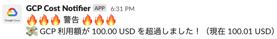

# gcp-cost-notification



Send alert to Slack when the cost exceeds the threshold set in Cloud Billing.

This system uses

- Cloud Billing
- Pub/Sub
- Google Cloud Functions
- Slack API

## Prerequisites

https://cloud.google.com/billing/docs/how-to/budgets

## Enviroment Variables

Enviroment variables to use in GCF runtime are set in `env.yaml` file.

(sample)
```yaml
SLACK_WEBHOOK_URL: <slack webhook url>
```

## Deploy Command

```
gcloud functions deploy CostAlert --env-vars-file env.yaml --trigger-topic <Pub/Sub topic name> --region=<region> --runtime=go113
```